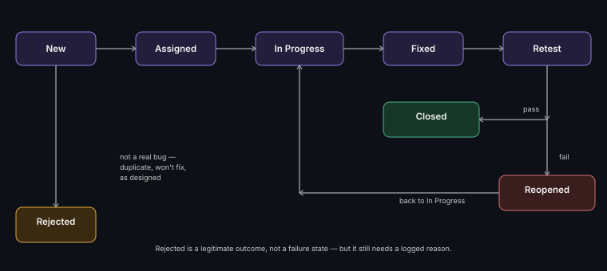

# Defect Life Cycle & Reporting

**Read time:** 4 min

---

A defect doesn't go from "found" to "fixed" in one step — it moves
through a defined set of states, and knowing that flow is what lets a
team have a real conversation about "where's this bug at" instead of a
vague one.

## The standard states

1. **New** — just logged, not yet triaged
2. **Assigned** — triaged, routed to a developer/team
3. **In Progress** — actively being worked
4. **Fixed** — developer believes it's resolved, ready for verification
5. **Retest** — QA verifies the fix against the original repro steps
6. **Closed** — verified fixed, done
7. **Reopened** — verification failed; the fix didn't actually work, or
   only partially worked — goes back to In Progress

A defect can also be marked **Rejected** (not a real bug — expected
behavior, duplicate, or "won't fix" by product decision) at triage or
after investigation — this is a legitimate outcome, not a failure state,
though a rejected defect should still have a clear reason logged.

## What a good defect report actually contains

- **Clear, specific title** — "Checkout fails" tells a triager nothing;
  "Checkout fails with 500 error when applying an expired promo code"
  lets them route and prioritize immediately
- **Exact repro steps** — numbered, specific, including test data used
- **Expected vs. actual result** — stated separately and explicitly, not
  implied
- **Environment details** — browser/OS/app version/environment — "works
  on my machine" mysteries are usually an undocumented environment
  difference
- **Severity** (see [Priority vs Severity](../qa-fundamentals/priority-vs-severity.md))
  and supporting evidence — screenshot, log excerpt, video for anything
  hard to describe in words alone

## The retest step people skip, and shouldn't

Marking a defect "Closed" the moment a developer says "fixed" — without
QA actually re-verifying against the original repro steps — is one of
the most common process shortcuts under deadline pressure, and one of
the most costly. A fix that resolves the reported symptom but not the
underlying cause looks identical to a real fix until someone actually
retests it.

## Best Practices

- Never skip the Retest step, even under time pressure — this is the
  step that actually confirms the bug is gone, not just that a change
  was made
- Write repro steps assuming the reader has zero context — specific
  enough that someone unfamiliar with the feature could follow them
  exactly
- Log a clear reason on every Rejected defect — "not reproducible" and
  "working as designed" require different follow-up, and an unexplained
  rejection erodes trust in the triage process over time

---
*Part of [QA, Quality Engineering & Quality Management Hub](../README.md) → [Defect & Test Management](./README.md)*
