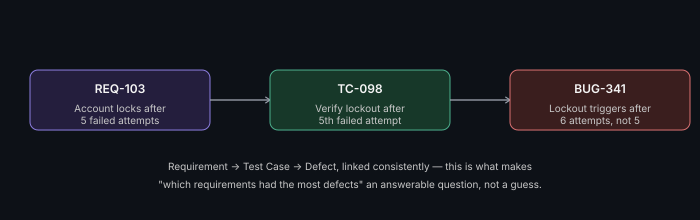

# Defect Mapping to Requirements

**Read time:** 3 min

---

Every defect should trace back to something — a requirement it violates,
or a test case that caught it. Without that link, defect data is just a
list of bugs; with it, defect data becomes a signal about *where*
quality problems actually cluster.

## Why the link matters more than the defect itself

A single defect is just one data point. A *mapped* defect — linked back
through its test case to the specific requirement — lets you ask a much
more useful question at the end of a project: "which requirements had
the most defects mapped to them?" That answer tells you where
requirements were ambiguous, where the implementation was genuinely
hard, or where testing wasn't thorough enough during design — three very
different root causes that all show up as "lots of bugs" if you're only
looking at raw defect counts.

## Where this connects to the Traceability Matrix

This is the natural extension of the
[Requirements Traceability Matrix](../qa-fundamentals/traceability-matrix.md)
— once test cases are linked to requirements, linking defects found
*during* execution of those test cases back to the same chain is a small
additional step with outsized analytical value later.

## What this analysis actually reveals in practice

- **Requirements with disproportionate defect counts** — often signals
  the requirement itself was ambiguous or under-specified, not that the
  implementation was simply "buggy"
- **Test cases that repeatedly catch defects across releases** — may
  indicate an area of the system that's genuinely fragile and needs
  architectural attention, not just more testing
- **Requirements with zero mapped defects** — either genuinely
  well-built, or under-tested; cross-reference against actual test
  execution to tell which

## Best Practices

- Make defect-to-requirement linking a required field at logging time,
  not an optional afterthought — data that's optional to enter is data
  that mostly doesn't get entered
- Review the defect-density-per-requirement view at project retro time,
  not just individual defect status — this is where the real process
  insight lives, and it's invisible if you only ever look at defects
  one at a time
- Use this data to inform *future* requirement-writing and test-design
  practices, not just to close out the current project — this is a
  feedback loop, treat it as one

---
*Part of [QA, Quality Engineering & Quality Management Hub](../README.md) → [Defect & Test Management](./README.md)*
