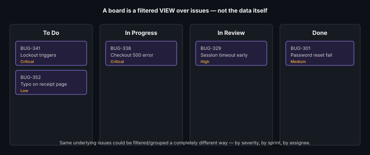

# Jira for QA Teams

**Read time:** 4 min

---

Jira is the most common defect/test-tracking tool QA teams encounter —
this isn't a button-by-button tutorial (UI specifics age fast; see the
version-agnostic teaching approach explained in the
[AI Tools Mastery Academy](https://github.com/abhibatsa/ai-tools-mastery-academy)
if you want the fuller argument for why) — it's the workflow concepts that
matter regardless of Jira's current UI.

## The core concepts that transfer to any similar tool

- **Issue types** — Bug, Task, Story, Epic — QA primarily lives in Bugs,
  but understanding how bugs relate to the Stories/Epics they're found
  against is what makes reporting genuinely useful, not just a bug list
- **Workflow states** — configurable per project, but almost always maps
  to the [defect life cycle](./defect-life-cycle-and-reporting.md) states
  underneath whatever labels a specific Jira project uses
- **Custom fields** — Severity, Environment, Steps to Reproduce — the
  actual content that makes a defect report useful lives here, not in
  the title
- **Boards and filters** — a Kanban or Scrum board is a *view* over the
  underlying issues, filtered and grouped by whatever's useful (assignee,
  severity, sprint) — the board isn't the data, it's one lens on it

## QA-specific workflow patterns worth knowing

- **Linking defects to test cases/requirements** — via issue links or a
  dedicated test-management plugin (Zephyr, Xray) — this is what turns
  Jira into the backing data source for a
  [traceability matrix](../qa-fundamentals/traceability-matrix.md)
  instead of a manually maintained spreadsheet
- **Using labels/components for cross-cutting reporting** — tagging
  defects by feature area or root-cause category enables the kind of
  [defect mapping](./defect-mapping.md) analysis that raw issue lists
  don't support on their own
- **JQL (Jira Query Language)** — the actual power-user skill; learning
  to write a specific query ("all Critical bugs opened this sprint,
  unassigned") beats manually scanning boards for the same answer

## Best Practices

- Standardize custom field usage across a team/project early — inconsistent
  severity labeling or missing environment data on some issues but not
  others makes later analysis unreliable
- Learn basic JQL — it's the single highest-leverage Jira skill for a QA
  lead who needs to answer ad hoc questions about defect data quickly
- Treat the board view as disposable/reconfigurable — the underlying
  issues and their data are what matters; don't over-invest in a
  specific board layout that'll need to change as the project evolves

---
*Part of [QA, Quality Engineering & Quality Management Hub](../README.md) → [Defect & Test Management](./README.md)*
