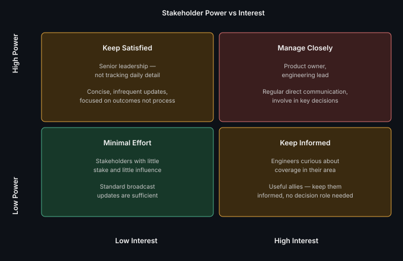

# Stakeholder Management for QA Leads

**Read time:** 4 min

---

QA sits at a natural friction point — the role that often has to say
"this isn't ready" to people under pressure to ship. Managing that
relationship well is a distinct skill from the technical practice of
testing itself.

## Mapping stakeholders before you need to manage them

A simple, genuinely useful tool: plot stakeholders by **power** (how much
influence they have over the project/decision) and **interest** (how
closely they're tracking QA's specific work) — it tells you how to
communicate with each, before a crisis forces the question.

- **High power, high interest** — manage closely; regular direct
  communication, involve in key decisions (a product owner, an
  engineering lead)
- **High power, low interest** — keep satisfied; concise, infrequent
  updates focused on outcomes, not process detail (often senior
  leadership — they need to trust the process, not audit it line by line)
- **Low power, high interest** — keep informed; they care and can be
  useful allies, but don't need decision-making involvement (other
  engineers curious about test coverage in their area)
- **Low power, low interest** — minimal effort; standard broadcast
  updates are sufficient

## The specific skill: delivering "not ready" under pressure

The hardest recurring stakeholder-management moment in QA is telling
someone under deadline pressure that quality isn't where it needs to be.
What actually works:

- **Lead with data, not opinion** — "12 open Critical defects, 3
  discovered in the last 24 hours" is harder to argue with than "I don't
  think we're ready"
- **Frame it as a decision, not a verdict** — "here's the risk if we
  ship now, here's what more time buys us" gives the stakeholder agency
  in the decision rather than positioning QA as the obstacle
- **Have this conversation early and often, not only at the deadline** —
  a stakeholder hearing about risk for the first time the day before
  release has no good options left; a stakeholder who's seen the trend
  building for two weeks can actually plan around it

## Best Practices

- Map your actual stakeholders explicitly at project start, don't
  assume you already know who needs what — the map changes per project
- Bring data to hard conversations, not just judgment — data is harder
  to dismiss and easier to act on
- Build the relationship *before* you need to deliver bad news — a QA
  lead stakeholders already trust gets a very different reception
  delivering "not ready" than one they're meeting for the first time in
  a crisis

---
*Part of [QA, Quality Engineering & Quality Management Hub](../README.md) → [Defect & Test Management](./README.md)*
