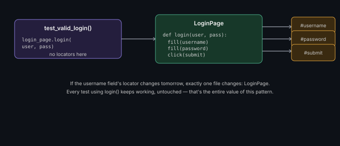

# Design Patterns in Test Automation

**Read time:** 5 min

---

The same design patterns covered in general OOP show up constantly in
test automation specifically — this doc covers the four that matter
most for test code, applied directly. For the general pattern
explanations, see the
[LLD & OOD Interview Prep repo](https://github.com/abhibatsa/lld-and-ood-interview-prep/tree/main/design-patterns)
— this doc is deliberately the "applied to test code" layer on top of
that, not a duplicate of it.

## Page Object Model (the Facade pattern, applied)

The foundational test automation pattern — one class per page/screen,
encapsulating its locators and interactions, so tests never touch
locators directly.



```python
class LoginPage:
    def __init__(self, driver):
        self.driver = driver
        self.username_field = (By.ID, "username")
        self.password_field = (By.ID, "password")
        self.submit_button = (By.ID, "submit")

    def login(self, username, password):
        self.driver.find_element(*self.username_field).send_keys(username)
        self.driver.find_element(*self.password_field).send_keys(password)
        self.driver.find_element(*self.submit_button).click()

# Test file — no locators, reads like a specification
def test_valid_login():
    login_page = LoginPage(driver)
    login_page.login("user@example.com", "password123")
    assert dashboard_page.is_loaded()
```

This is structurally a [Facade](https://github.com/abhibatsa/lld-and-ood-interview-prep/blob/main/design-patterns/structural/facade.md)
— `LoginPage` hides the complexity of locating and interacting with
multiple elements behind one simple `login()` call.

## Factory (for driver/browser creation)

Centralizes creation logic for objects that vary by configuration —
classic use case: creating the right WebDriver instance for whichever
browser a test run targets.

```python
class DriverFactory:
    @staticmethod
    def get_driver(browser_type):
        if browser_type == "chrome":
            return webdriver.Chrome()
        elif browser_type == "firefox":
            return webdriver.Firefox()
        raise ValueError(f"Unsupported browser: {browser_type}")
```

Avoids scattering `if browser == "chrome"` conditionals across every
test file — one place to add support for a new browser.

## Singleton (for shared framework resources)

Ensures one shared instance of something that shouldn't be duplicated
per test — a config loader, a database connection pool used across a
test suite.

```python
class TestConfig:
    _instance = None
    def __new__(cls):
        if cls._instance is None:
            cls._instance = super().__new__(cls)
            cls._instance.load_config()
        return cls._instance
```

**Use sparingly** — the same overuse caution that applies to Singleton
in general OOP applies here; most objects in a test framework shouldn't
be singletons, only genuinely shared, expensive-to-recreate resources.

## Strategy (for swappable test behaviors)

Useful when the same test logic needs to run against interchangeable
implementations — e.g., the same suite of assertions run against
different environments' data providers, or different wait strategies
per platform (web vs. mobile).

```python
class WaitStrategy:
    def wait_for_element(self, locator): pass

class ExplicitWaitStrategy(WaitStrategy):
    def wait_for_element(self, locator):
        WebDriverWait(driver, 10).until(EC.presence_of_element_located(locator))
```

## Best Practices

- Start with Page Object Model on any real UI automation project — it's
  the highest-leverage pattern in this list and the one whose absence
  causes the most maintenance pain
- Use Factory the moment you support more than one browser/environment
  configuration — don't wait until the conditional-branching mess
  already exists to introduce it
- Apply the same "does this pattern earn its complexity" judgment here
  as in general OOP design — a 5-test suite doesn't need the full
  pattern arsenal; a 500-test suite almost certainly does

---
*Part of [QA, Quality Engineering & Quality Management Hub](../README.md) → [Framework Development & Design Patterns](./README.md)*
