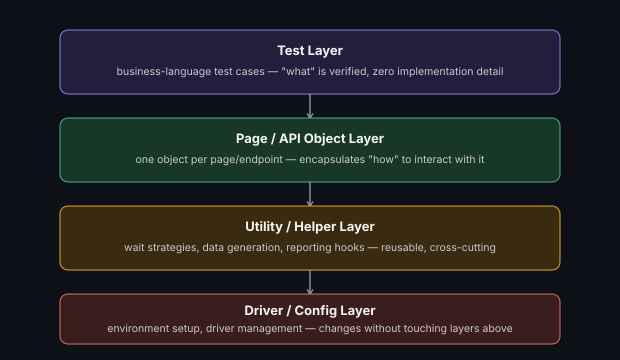

# Test Automation Framework Design Principles

**Read time:** 5 min

---

Most bad automation frameworks aren't bad because of a wrong tool
choice — they're bad because of the same three or four architectural
mistakes, repeated. This is the checklist that prevents them.

## The layered structure that actually scales

- **Test layer** — the actual test cases, written in business/behavior
  language (what's being verified), with zero implementation detail
- **Page/screen/API-object layer** — one object per page/screen/endpoint,
  encapsulating *how* to interact with it (locators, request building)
- **Utility/helper layer** — reusable cross-cutting logic (wait
  strategies, data generation, reporting hooks) that isn't specific to
  any one page or test
- **Driver/config layer** — environment setup, driver management,
  configuration loading — the layer that changes when you move between
  environments, ideally without touching anything above it

**Why this layering matters:** when a UI locator changes, you fix it in
one page-object file — not in fifty test files that happened to
reference that element directly. This is
[Composition Over Inheritance](https://github.com/abhibatsa/lld-and-ood-interview-prep/blob/main/design-principles/composition-over-inheritance.md)
and [Single Responsibility](https://github.com/abhibatsa/lld-and-ood-interview-prep/blob/main/design-principles/solid-with-code.md)
applied directly to test code, not just application code.

## Principles worth stating explicitly

- **Tests should read like specifications, not implementation** — a
  test method should describe *what's* being verified in
  business terms; the *how* belongs in the layer below it
- **No hardcoded waits** — `sleep(5)` is the single most common flaky-
  test cause in this repo family's experience; use explicit waits tied to
  an actual condition, not a guessed duration
- **Test independence** — no test should depend on another test having
  run first, or on execution order at all; shared state between tests is
  how a passing suite becomes a randomly-failing one the moment tests
  run in parallel or a different order
- **Fail with a useful message** — a failure that just says
  "AssertionError" wastes the next person's time; log what was expected,
  what was actually found, and enough context to reproduce without
  re-running the whole suite

## The failure mode this prevents: the "God object" framework

Frameworks that skip proper layering tend to converge on one of two bad
shapes: either every test file duplicates locators and setup logic (a
maintenance nightmare when the UI changes), or one giant utility class
accumulates everything unrelated (a different maintenance nightmare,
just concentrated in one file nobody wants to touch). The layered
structure above is specifically the fix for both failure modes at once.

## Best Practices

- Establish the layer structure *before* writing the first test, not
  after 50 tests reveal the lack of one — retrofitting structure onto an
  unstructured suite is far more expensive than starting with it
- Enforce "no direct page interaction from test files" as a real code-
  review rule, not just a guideline — this is the discipline that keeps
  the layering intact as a team grows
- Revisit the utility layer periodically for accumulated cruft — it's
  the layer most prone to becoming a dumping ground over time

---
*Part of [QA, Quality Engineering & Quality Management Hub](../README.md) → [Framework Development & Design Patterns](./README.md)*
