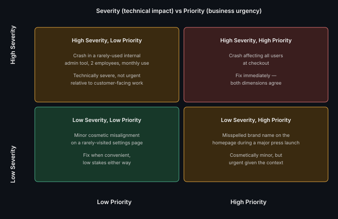

# Priority vs Severity

**Read time:** 3 min

---

The single most common mix-up new QA testers make — and a distinction
worth genuinely understanding, not just memorizing, because getting it
backwards leads to real triage mistakes.

## The actual definitions

**Severity** — how *bad* the defect's technical/functional impact is.
Set by QA, based on what's broken. Objective-ish: a crash is more severe
than a cosmetic misalignment, regardless of who's affected or when.

**Priority** — how *urgently* it needs to be fixed, relative to
everything else in the queue. Set by the team/product owner, based on
business context. A cosmetic issue on the homepage of a high-traffic
launch day can be high priority despite low severity.

## The classic mismatch examples

- **High severity, low priority:** a crash in a rarely-used admin tool
  that only 2 internal employees touch once a month — technically severe
  (it crashes), but not urgent relative to customer-facing work
- **Low severity, high priority:** a misspelled brand name on the
  homepage the day of a major press launch — cosmetically minor, but
  extremely urgent given the context

## Why the mix-up actually causes problems

If a tester sets *priority* instead of *severity* (or vice versa) when
logging a defect, triage decisions get made on wrong information — a
truly severe bug might get deprioritized because it was logged as "low"
severity when the tester actually meant low priority, or a team wastes a
sprint on a low-severity issue mislabeled as high-severity urgent.

## Best Practices

- As a tester, set severity based purely on technical/functional
  impact — leave priority-setting (business urgency) to product/triage,
  since you often don't have full visibility into competing business
  priorities
- When in doubt, describe the actual impact in the defect description
  in plain language, not just the severity label — "crashes the app for
  all users on checkout" communicates more reliably than "Severity:
  Critical" alone
- Revisit priority (not severity) as business context changes — a bug's
  technical severity doesn't change over time, but its priority
  legitimately can (e.g., right before a big client demo)

---
*Part of [QA, Quality Engineering & Quality Management Hub](../README.md) → [QA & Testing Fundamentals](./README.md)*
