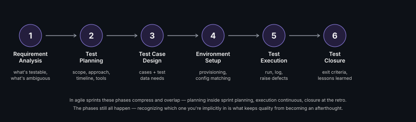

# STLC (Software Testing Life Cycle)

**Read time:** 4 min

---

STLC is the sequence of phases testing goes through on any real project —
knowing it cold matters less for reciting the phase names and more for
knowing what breaks when a phase gets skipped, which happens constantly
under deadline pressure.

## The six phases

1. **Requirement Analysis** — understand what's being built well enough
   to identify what's testable and what's ambiguous. The most-skipped
   phase under time pressure, and the one whose skipping causes the most
   expensive downstream rework.
2. **Test Planning** — scope, approach, resources, timeline, tools (see
   [Test Planning](./test-planning.md) for the full breakdown)
3. **Test Case Design** — writing test cases and identifying test data
   needs (see [Test Case Design Techniques](./test-case-design-techniques.md))
4. **Environment Setup** — provisioning test environments, data,
   configuration matching (or deliberately differing from) production
5. **Test Execution** — running tests, logging results, raising defects
6. **Test Closure** — evaluating exit criteria, documenting lessons
   learned, archiving artifacts for the next cycle

## What actually breaks when a phase is skipped

- **Skipping Requirement Analysis** → test cases get written against
  assumptions instead of actual requirements, and defects surface late
  because "that's not what we meant" wasn't caught early
- **Skipping proper Environment Setup** → the classic "works on staging,
  fails in prod" gap, usually traced back to an environment difference
  nobody documented
- **Skipping Test Closure** → the same mistakes repeat next cycle,
  because nothing was captured about what went wrong this time

## Where teams actually adapt this in practice

STLC as six discrete, sequential phases is the textbook version. In a
real agile sprint, most of these phases compress and overlap — planning
and case design happen inside sprint planning, execution is continuous
through the sprint, closure is the sprint retro. The phases still all
happen; they just don't happen as six visible, separate stage-gates.
Recognizing which phase you're implicitly in, even inside a fast sprint,
is what keeps quality from becoming an afterthought.

## Best Practices

- Treat Requirement Analysis as non-negotiable even under time pressure
  — ambiguity caught here is cheap; ambiguity caught in execution is
  expensive
- Keep a lightweight Test Closure step even in fast-moving sprints — a
  5-minute "what did we miss this cycle" beats nothing
- Match STLC's rigor to the project's actual risk profile — a
  low-risk internal tool doesn't need the same ceremony as a payments
  feature; scaling the process to the risk is itself a QE skill

---
*Part of [QA, Quality Engineering & Quality Management Hub](../README.md) → [QA & Testing Fundamentals](./README.md)*
