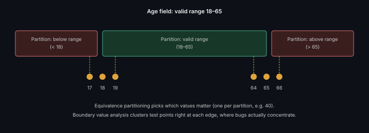

# Test Case Design Techniques

**Read time:** 5 min

---

Writing test cases by intuition ("let me think of some inputs to try")
misses systematic categories of bugs. These techniques exist to make
coverage *structured* rather than dependent on what the tester happened
to think of.

## Equivalence Partitioning

Split inputs into groups ("partitions") that should behave the same way
— then test *one* representative value per partition instead of every
possible value. If an age field accepts 18-65, you don't need to test
every number from 18 to 65; you need one valid value, one below-range
value, one above-range value, because everything within a partition
should behave identically.

**Why it matters:** it turns "infinite possible inputs" into a small,
justified set of test cases, without leaving systematic gaps.

## Boundary Value Analysis

Bugs cluster at boundaries far more often than in the middle of a valid
range — off-by-one errors are the classic example. For a field accepting
18-65: test 17, 18, 19 (just below, at, just above the lower boundary)
and 64, 65, 66 (same at the upper boundary). This is the single
highest-value technique in this list relative to effort — boundary bugs
are common and boundary tests are cheap to write.

## Decision Table Testing

For logic with multiple conditions combining to determine an outcome
(e.g., "discount applies if: loyalty member AND order > $50, OR promo
code valid"), a decision table systematically lists every combination of
conditions and the expected outcome for each — catching the specific
combination nobody thought to test manually, which is exactly where
conditional-logic bugs hide.

## State Transition Testing

For anything with a lifecycle (order status, user account state), test
not just each state but the *valid and invalid transitions* between
them. Directly pairs with a [state machine diagram](https://github.com/abhibatsa/lld-and-ood-interview-prep/blob/main/uml/state-machine-diagram.md)
— draw the diagram first, then write a test case for every transition
arrow, and specifically for transitions that *shouldn't* be possible
(can a Cancelled order go back to Shipped? Test that it can't.)

## Best Practices

- Use boundary value analysis by default on every numeric/range input —
  it's the best effort-to-bug-found ratio of any technique here
- Combine techniques — equivalence partitioning to decide *which* values
  matter, boundary analysis to test the edges of each partition
  specifically
- For anything with real conditional complexity, build the decision
  table before writing test cases, not after — writing cases first and
  discovering missed combinations later is the expensive order to do
  this in

---
*Part of [QA, Quality Engineering & Quality Management Hub](../README.md) → [QA & Testing Fundamentals](./README.md)*
