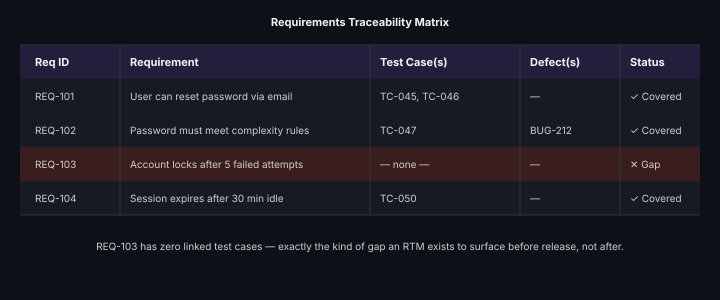

# Requirements Traceability Matrix

**Read time:** 4 min

---

A Requirements Traceability Matrix (RTM) is the answer to two questions
that come up constantly, and are painful to answer without one: **"is
every requirement actually covered by a test?"** and **"if this
requirement changes, which tests need to be re-run?"**

## What it actually looks like

A simple table mapping requirements to the test cases that verify them
(and often, further to defects found against those test cases). The
value isn't the table's format — it's the *link* itself, kept current.

## What it's actually for

- **Coverage verification** — scanning for a requirement row with zero
  linked test cases is the fastest way to catch "we never actually wrote
  a test for that" before it becomes a production incident
- **Impact analysis on requirement change** — when a requirement changes
  mid-project (it will), the RTM tells you exactly which test cases need
  review, instead of a team member trying to remember from memory
- **Audit/compliance evidence** — in regulated industries, "prove this
  requirement was tested" is a real, recurring ask, and an RTM is the
  direct answer

## Why teams stop maintaining these (and what to do instead)

RTMs built as a one-time spreadsheet exercise go stale within weeks —
requirements change, test cases get added/removed, and nobody updates
the matrix because it's disconnected from the actual work. The fix isn't
discipline, it's **tooling**: modern test management tools (TestRail,
Zephyr, Xray, etc.) generate traceability automatically from
linked requirements and test cases, rather than requiring a manually
maintained spreadsheet. If you're on a project without such a tool, a
lightweight manually-maintained matrix beats none — but know its
staleness risk going in.

## Best Practices

- Prefer tool-generated traceability over a manually maintained
  spreadsheet whenever the option exists — staleness is the main failure
  mode, and tooling addresses it structurally rather than relying on
  discipline
- Review the matrix specifically for zero-coverage requirements before
  each release, not just when someone asks for it
- Keep the granularity practical — mapping every requirement to every
  individual test case can become its own maintenance burden; map at
  the level that's actually useful for coverage and impact-analysis
  decisions, not maximum theoretical detail

---
*Part of [QA, Quality Engineering & Quality Management Hub](../README.md) → [QA & Testing Fundamentals](./README.md)*
