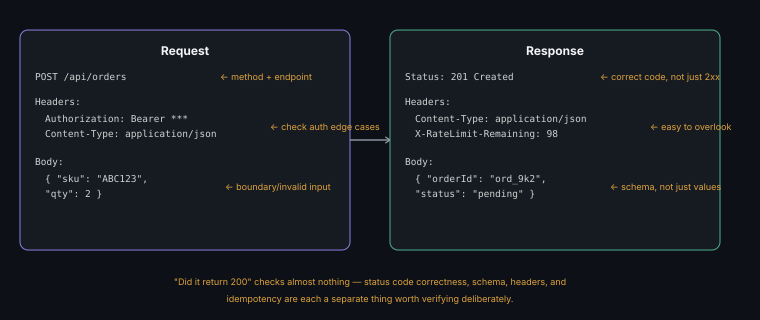

# API Testing, Automation & Debugging

**Read time:** 5 min

---

API testing catches a category of bugs UI testing structurally can't
reach efficiently — and it's usually faster and more stable than UI
automation for verifying the same underlying logic, since there's no
rendering/timing flakiness to fight.

## What to actually verify, beyond "did it return 200"

- **Status code correctness** — not just success/failure, but the
  *right* code: 400 for bad input, 401 for missing auth, 403 for
  forbidden, 404 for not found, 409 for conflict — a service that
  returns 500 for a client input error is itself a bug, separate from
  whatever the original test was checking
- **Response body/schema** — correct fields, correct types, no
  unexpected nulls where a value is required — schema validation
  (checking structure, not just spot-checking a few fields) catches
  a whole category of "technically responded, but wrong shape" bugs
- **Headers** — content-type, caching headers, rate-limit headers where
  applicable — easy to overlook, occasionally where the actual bug lives
- **Response time** — not full performance testing, but a basic
  sanity check that a normally-fast endpoint hasn't silently regressed
- **Idempotency and side effects** — does calling the same request twice
  do what it should (see [idempotency](https://github.com/abhibatsa/architecting-software/blob/main/01-system-design-and-architecture/01-core-concepts/idempotency-and-exactly-once-delivery.md)
  for the deeper system-design version of this concept — this is the
  testing-side application of it)

## Common API bug categories worth deliberately testing for

- **Boundary/invalid input handling** — same
  [boundary value analysis](../qa-fundamentals/test-case-design-techniques.md)
  principle applied to API payloads, not just UI form fields
- **Auth/authorization edge cases** — expired tokens, missing tokens,
  tokens with insufficient permission — these are commonly under-tested
  because they require more setup than the happy path
- **Pagination edge cases** — empty result sets, single-page results,
  requesting a page beyond the last one
- **Error response consistency** — does every endpoint return errors in
  the same shape, or does each one invent its own — inconsistency here
  is a real integration pain point for API consumers, worth flagging
  even when each individual case "works"

## Debugging an API test failure

1. Check the actual request sent (headers, body) before assuming the
   server's response is wrong — a malformed or incomplete request is a
   common false-positive cause
2. Compare the actual response against the documented/expected schema,
   not just against what "looks right"
3. Reproduce the same request outside your test framework (via a manual
   API client) to isolate whether the failure is in the API itself or in
   the test code around it

## Best Practices

- Validate schema, not just individual field values — a response that
  happens to have the right data today but the wrong structure will
  break a consumer the moment that consumer expects the documented shape
- Deliberately test auth/authorization edge cases as a standing category,
  not just when a specific bug prompts it — these are chronically
  under-tested relative to how often they matter
- When an API test fails, isolate request-vs-response before debugging
  further — this single step prevents a lot of wasted time chasing the
  wrong side of the interaction

---
*Part of [QA, Quality Engineering & Quality Management Hub](../README.md) → [Web, Mobile & API Testing](./README.md)*
