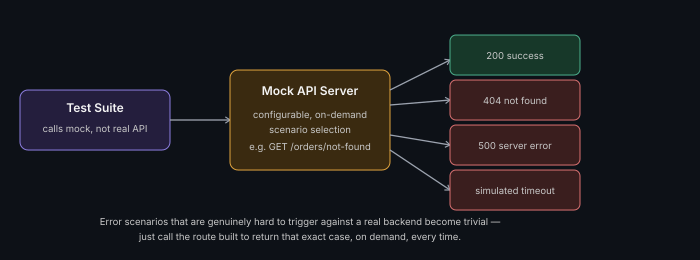

# Building a REST API for Test/Mock Purposes

**Read time:** 4 min

---

Sometimes the fastest way to unblock testing isn't waiting for a real
backend endpoint to be ready — it's building a small mock/stub API
yourself. This is a genuinely useful QA skill, not just a developer task.



## When building a mock API is the right call

- **Testing a frontend before its backend is ready** — a mock returning
  realistic canned responses lets frontend testing proceed in parallel
  with backend development, instead of blocking on it
- **Simulating error conditions hard to trigger against a real backend**
  — a real API might be genuinely difficult to force into a 500 error or
  a timeout on demand; a mock can return exactly that on command, every time
- **Isolating a test from a flaky or rate-limited third-party
  dependency** — if a test suite calls a real third-party API, a mock
  removes that dependency's instability from your test results entirely
- **Contract testing** — a mock built to match an agreed-upon API
  contract/schema lets both frontend and backend teams verify against
  the same expectations independently, before integration

## What a good test mock actually needs

- **Realistic response shapes** — matching the real API's actual
  schema, not a simplified placeholder — a mock that doesn't match
  reality gives false confidence
- **Configurable responses** — the ability to easily switch a given
  endpoint between success, various error codes, and edge cases (empty
  results, malformed data) without rewriting the mock each time
- **Deliberate latency/timeout simulation** — if you need to test how
  the system under test handles a slow or hanging response, the mock
  needs to be able to simulate that on purpose

## A minimal example (Python/Flask)

```python
from flask import Flask, jsonify, request

app = Flask(__name__)

@app.route("/api/orders/<order_id>", methods=["GET"])
def get_order(order_id):
    if order_id == "not-found":
        return jsonify({"error": "Order not found"}), 404
    if order_id == "server-error":
        return jsonify({"error": "Internal error"}), 500
    return jsonify({"orderId": order_id, "status": "shipped"}), 200
```

A few named routes like this, each deliberately returning a specific
scenario, is often all a test suite needs — no need for a fully
general-purpose mock server for most testing use cases.

## Best Practices

- Keep mock responses genuinely in sync with the real API's actual
  schema — a stale mock that no longer matches reality is worse than no
  mock, because it hides integration bugs until they hit a real environment
- Version-control the mock alongside the tests that use it, so schema
  drift between mock and reality is at least visible in code review
- Use mocks to test genuinely hard-to-trigger scenarios (specific error
  codes, timeouts, malformed responses) — this is where a mock earns its
  keep well beyond just "unblocking parallel development"

---
*Part of [QA, Quality Engineering & Quality Management Hub](../README.md) → [Web, Mobile & API Testing](./README.md)*
