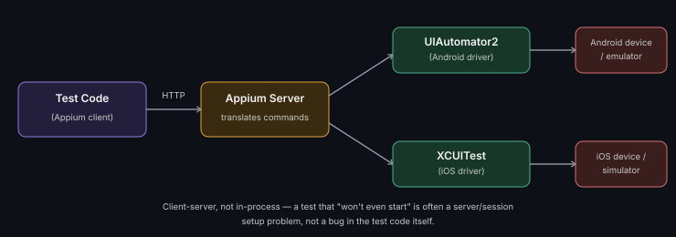

# Mobile App Automation & Testing

**Read time:** 4 min

---

Mobile testing shares principles with web testing (locators, waits, page
objects) but has a genuinely different execution model — understanding
that model matters more than memorizing any one tool's syntax.

## The execution model: client-server, not in-process

Unlike a web browser driver that runs in the same process as your test,
mobile automation (Appium being the standard) works client-server: your
test code is the *client*, sending commands over HTTP to an Appium
*server*, which translates those commands into platform-specific
instructions (Android's UIAutomator2, iOS's XCUITest) that actually
drive the device or emulator/simulator.

**Why this matters practically:** a surprising share of "my test won't
even start" problems are Appium server/session setup issues, not test
code bugs — understanding the client-server model is what lets you
debug at the right layer instead of assuming your test code is wrong.

## Real device vs. emulator/simulator — a genuine trade-off

- **Emulator/Simulator** — faster to spin up, easier to run in CI, but
  can miss real-device-specific bugs (actual hardware performance,
  real network conditions, OS-version-specific quirks)
- **Real device** — catches what emulators miss, required for certain
  categories of testing (camera, biometrics, real GPS), but slower to
  provision and harder to scale in CI without a device farm

**The practical answer:** most teams use emulators/simulators for the
bulk of automated regression (fast feedback), and reserve real-device
testing for release candidates and features genuinely sensitive to
real-hardware behavior.

## Locator strategy on mobile

Same underlying principle as web (prefer stable, dedicated test
identifiers over fragile ones), different specifics:
- **Android:** prefer `resource-id` (from the accessibility tree) over
  XPath where available — more stable across minor UI changes
- **iOS:** prefer accessibility identifiers set deliberately by
  developers over relying on visible text (which changes with
  localization) or fragile element hierarchies

## Best Practices

- Push for accessibility identifiers/test IDs to be added during
  development, same discipline as `data-testid` on web — retrofitting
  locators after the fact is always more expensive
- Understand which bugs your emulator/simulator strategy structurally
  can't catch, and make sure those categories get real-device coverage
  somewhere in the process, even if not fully automated
- When a test fails to even start, check the Appium server/session setup
  before assuming the test script itself is wrong — this single habit
  saves significant debugging time given how the client-server model works

---
*Part of [QA, Quality Engineering & Quality Management Hub](../README.md) → [Web, Mobile & API Testing](./README.md)*
