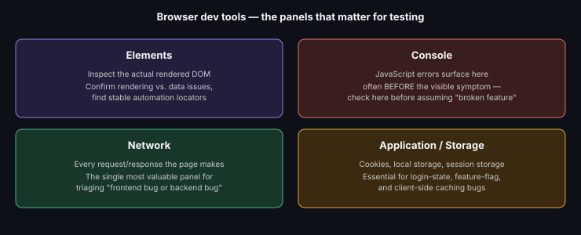

# Web Automation, Testing & Debugging

**Read time:** 4 min

---

Before reaching for an automation framework, browser dev tools are the
first debugging instrument every web tester should be fluent in — a
surprising amount of "is this a real bug" investigation happens here,
not in code.

## The panels that matter most for testing

- **Elements** — inspect the actual rendered DOM, not just the source —
  critical for confirming whether a UI bug is a rendering issue or a
  data issue, and for finding stable locators for automation
- **Console** — JavaScript errors surface here, often *before* a visible
  UI symptom appears — a blank section on a page is frequently a JS
  error logged here, not a "the feature is broken" mystery
- **Network** — every request/response the page makes; this is where you
  confirm whether a bug is frontend (wrong data rendered) or backend
  (wrong data returned) — the single most valuable panel for triaging
  "is this my bug to report to frontend or backend"
- **Application/Storage** — cookies, local storage, session storage —
  essential for anything involving login state, feature flags, or
  client-side caching bugs

## The debugging habit that saves the most time

**Check Network before assuming a UI bug is a UI bug.** A very common
wasted-effort pattern: a QA tester spends time trying to reproduce a
"missing data" bug through UI interactions, when the Network tab would
have shown in 10 seconds that the API call itself returned an empty
array — meaning the actual bug is upstream, not in what's rendering.

## Automation locator strategy, informed by dev tools

- Prefer `data-testid` or similar dedicated test attributes over CSS
  classes or generated IDs — classes change with styling, generated IDs
  change on rebuild, a dedicated test attribute is stable by design
- Use the Elements panel to verify a locator's uniqueness *before*
  writing automation against it — a locator that happens to work once
  but matches multiple elements is a flaky test waiting to happen
- Avoid deeply nested CSS selectors (`div > div > span:nth-child(3)`) —
  they break the moment the page structure changes even slightly, and
  they're painful to read in a failing test's error output

## Best Practices

- Reflexively check Console and Network before filing any "unexpected
  behavior" bug — this alone resolves a large share of "is this really a
  bug" ambiguity before it reaches a developer
- Build locator strategy into the definition of done for new features —
  requesting `data-testid` attributes during development is far cheaper
  than retrofitting them after automation is already written against
  fragile selectors
- Keep a personal cheat-sheet of the specific dev tools workflows you use
  repeatedly (e.g., "filter Network by XHR, search for the failing
  endpoint") — dev tools have a lot of surface area, and most people only
  need a consistent subset of it

---
*Part of [QA, Quality Engineering & Quality Management Hub](../README.md) → [Web, Mobile & API Testing](./README.md)*
